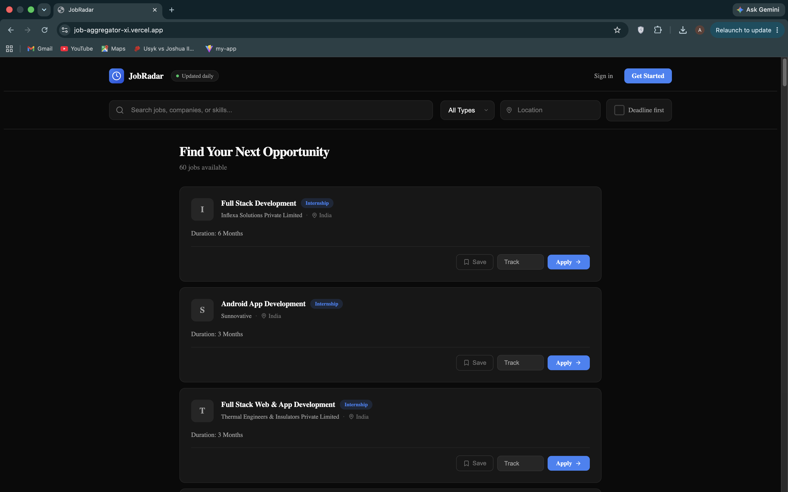
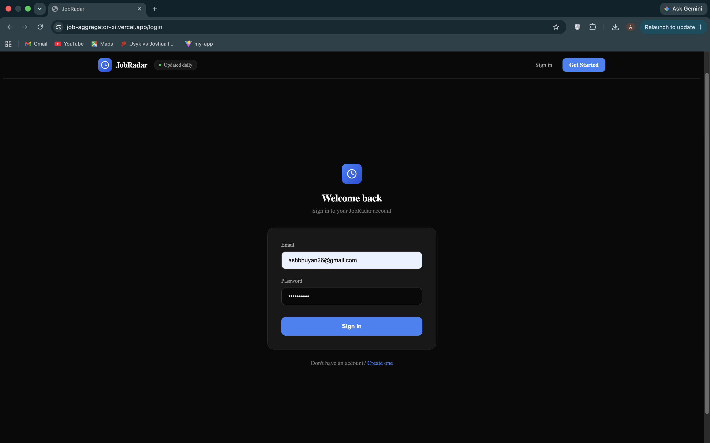
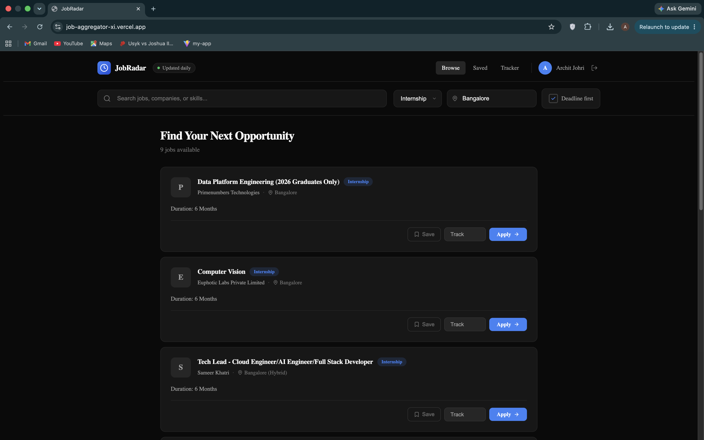
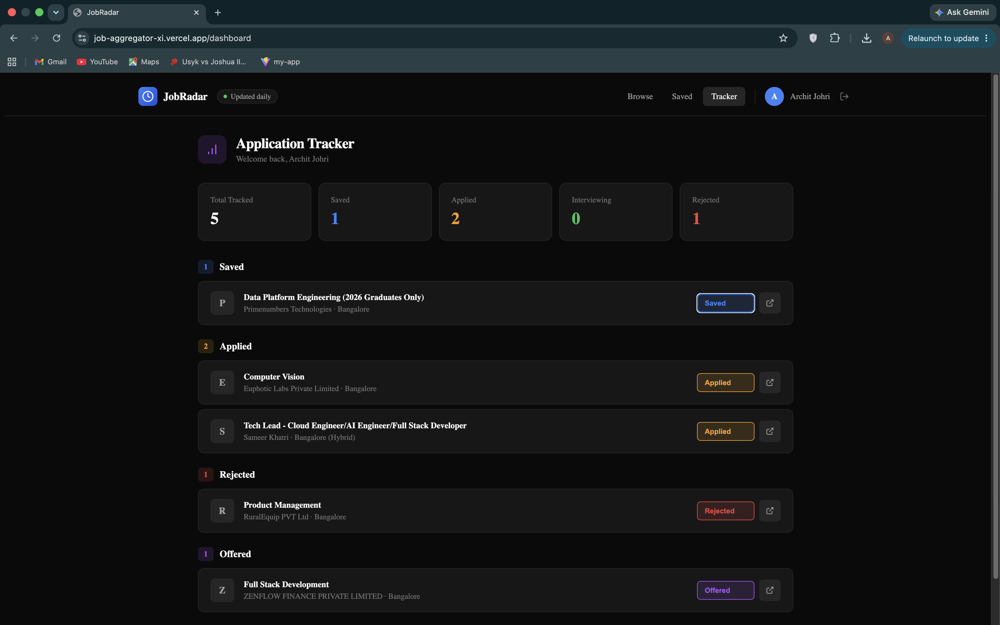

# JobRadar 🔍

A full-stack MERN job aggregator that automatically collects internship and full-time listings daily from multiple sources and displays them in one place — with smart filtering, bookmarks, and an application tracker.

🔗 **Live Demo:** https://job-aggregator-xi.vercel.app/

---

## Screenshots

### Home — Job Feed


### Authentication


### Filtering & Search


### Application Tracker Dashboard


---

## Features

- 🔄 **Automated daily pipeline** — cron job fetches fresh listings every midnight with zero manual intervention
- 🌐 **Multi-source aggregation** — JSearch API (LinkedIn/Indeed) + custom Puppeteer scraper (Internshala)
- 🔍 **Smart filtering** — filter by role, type, location, deadline; debounced search prevents unnecessary API calls
- 🔐 **JWT Authentication** — secure register/login with bcrypt password hashing, token persisted across sessions
- 🔖 **Per-user bookmarks** — saved jobs stored in MongoDB per account, synced across devices
- 📊 **Application tracker** — track status across Saved, Applied, Interviewing, Rejected, Offered with real-time dashboard
- 🛡️ **Protected routes** — frontend and backend both enforce authentication independently

---

## Tech Stack

| Layer | Technologies |
|-------|-------------|
| Frontend | React, React Router v6, Context API, Axios |
| Backend | Node.js, Express.js |
| Database | MongoDB, Mongoose |
| Auth | JWT (jsonwebtoken), bcryptjs |
| Data Pipeline | node-cron, Puppeteer, Axios, JSearch API |
| Deployment | Vercel (frontend), Render (backend), MongoDB Atlas |

---

## Architecture
Internshala (Puppeteer scraper) ──┐

├──→ MongoDB Atlas ──→ Express REST API ──→ React UI

JSearch API (Axios) ───────────────┘               ↑

node-cron

(runs daily midnight)
Auth flow: Register/Login → bcrypt hash → JWT issued →

axios interceptor attaches token → protect middleware verifies

---

## Project Structure
job-aggregator/

├── server.js                  entry point

├── models/

│   ├── Job.js                 job schema + unique index

│   └── User.js                user schema + embedded applications

├── controllers/

│   ├── jobController.js       dynamic filtering + MongoDB queries

│   ├── authController.js      register, login, JWT generation

│   └── userController.js      bookmarks, application tracking

├── routes/

│   ├── jobs.js

│   ├── auth.js

│   └── user.js

├── middleware/

│   └── auth.js                JWT protect middleware

├── cron/

│   ├── scheduler.js           midnight cron trigger

│   └── fetchJobs.js           JSearch + Internshala pipeline

├── scrapers/

│   └── internshala.js         Puppeteer headless browser scraper

└── client/                    React frontend

└── src/

├── api/               axios calls + request interceptor

├── context/           AuthContext — global auth state

├── components/        Navbar, FilterBar, JobCard, ProtectedRoute

└── pages/             Home, Login, Register, Dashboard

---

## Getting Started

### Prerequisites
- Node.js v18+
- MongoDB running locally (or MongoDB Atlas)
- RapidAPI account — [JSearch API](https://rapidapi.com/letscrape-6bRBa3QguO5/api/jsearch) (free tier: 100 req/day)

### Installation

```bash
git clone https://github.com/AdriCode/Job_Aggregator.git
cd Job_Aggregator
npm install
cd client && npm install
```

### Environment Variables

Create `.env` in the root directory:
MONGO_URI=mongodb://localhost:27017/jobAggregator

PORT=5000

JSEARCH_API_KEY=your_jsearch_key_here

JWT_SECRET=your_long_random_secret_here

Create `client/.env`:
REACT_APP_API_URL=http://localhost:5000/api

### Run Locally

```bash
# Backend (from root)
node server.js

# Frontend (from /client)
npm start
```

Backend → `http://localhost:5000`
Frontend → `http://localhost:3000`

### Manually trigger job fetch
GET http://localhost:5000/api/jobs/fetch-now
Requires a valid JWT in Authorization header.

---

## API Reference

| Method | Endpoint | Description | Auth |
|--------|----------|-------------|------|
| GET | `/api/jobs` | Get jobs with optional filters | No |
| GET | `/api/jobs?type=internship` | Filter by type | No |
| GET | `/api/jobs?search=react` | Search by keyword | No |
| GET | `/api/jobs?sortByDeadline=true` | Sort by deadline | No |
| POST | `/api/auth/register` | Register new user | No |
| POST | `/api/auth/login` | Login and receive JWT | No |
| GET | `/api/auth/me` | Get current user profile | Yes |
| POST | `/api/user/bookmark/:jobId` | Toggle bookmark | Yes |
| POST | `/api/user/application` | Add or update application status | Yes |
| GET | `/api/user/applications` | Get all tracked applications | Yes |

---

## Key Implementation Details

### Why Puppeteer over Cheerio
Internshala renders job listings dynamically with JavaScript after the initial page load. Cheerio only parses the static HTML the server returns — job cards don't exist there yet. Puppeteer launches a real headless Chrome browser, waits for JavaScript to execute (`networkidle2`), waits for job card elements to appear in the DOM (`waitForSelector`), then extracts data via `page.evaluate()` which runs inside the actual browser context.

### JWT Authentication Flow
On login/register the server signs a JWT containing the user's ID using a secret key. React stores it in localStorage. An axios request interceptor automatically attaches it as a Bearer token on every outgoing request. A `protect` middleware on the backend verifies the JWT signature on every protected route — the user ID is always read from the verified token, never from the request body, preventing impersonation.

### Duplicate Prevention
A unique MongoDB index on `applyLink` ensures no duplicate listings accumulate across daily cron runs. Duplicate key errors (code 11000) are silently caught and skipped. Any other insertion error is logged.

### Debounced Search
Search uses a 500ms debounce via `setTimeout` inside `useEffect`. The cleanup function (`return () => clearTimeout(timer)`) cancels the pending timer on every re-run — so only one API call fires after the user stops typing, regardless of how fast they type.

### Data Normalization
JSearch and Internshala use completely different field names and structures. Both scrapers normalize their output into the same Job schema before saving. The frontend always receives `title`, `company`, `location`, `applyLink` regardless of source — it never needs to know where a job came from.

---

## Deployment

| Service | Platform | URL |
|---------|----------|-----|
| Frontend | Vercel | https://job-aggregator-xi.vercel.app/ |
| Backend | Render | https://job-aggregator-sx4n.onrender.com |
| Database | MongoDB Atlas | Cloud hosted |

> **Note:** Backend is hosted on Render's free tier — the server spins down after 15 minutes of inactivity. The first request after inactivity may take 30-50 seconds to respond (cold start). Subsequent requests are fast.

---

## Planned Improvements

- Email notifications via Nodemailer when bookmarked job deadlines are within 3 days
- Pagination instead of fixed 50-job limit
- Unstop.com scraper for college-specific listings and hackathons

---

## Author

**Ashwath Bhuyan**
B.Tech Information Technology — Delhi Technological University (2023–2027)
[GitHub](https://github.com/AdriCode) • ashbhuyan26@gmail.com